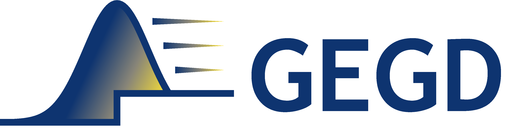

# Gaussian Ensemble Gradient Descent (GEGD): Ensemble-Based Global Search Framework for the Design Optimization of Fabrication-Constrained Freeform Devices



Gaussian ensemble gradient descent (GEGD) is an optimization algorithm in which the ensemble average of the cost function sampled under a multivariate Gaussian distribution is minimized by varying the mean of the distribution. This is mathematically equivalent to transforming the cost function by convolution with a Gaussian kernel. The optimization algorithm aims to solve two outstanding challenges in freeform density-based topology optimization.

1. The lack of a differentiable parameterization method for strictly fabrication-feasible designs that satisfy both material (binarization) and geometric (minimum feature size) constraints.
  - Conventional methods employ continuous latent densities that map to (near-)feasible designs in order to enable gradient descent in a continuous domain. However, they are either differentiable but not strictly feasible (e.g., three-field) or non-differentiable but strictly feasible (e.g., always-feasible). On the other hand, GEGD smooths the piecewise constant always-feasible cost function by convolution allowing gradient descent, while maintaining an ensemble of strictly feasible designs at every iteration, thus simultaneously achieving **full differentiability** and **strict feasibility**.

2. The lack of an efficient global search method for topology optimization due to the inherently large number of parameters of density-based freeform designs.
  - Gradient-based local optimization is efficient in high dimensions, but results depend heavily on initialization. Heuristic global search methods (e.g., PSO, GA) require too many samples to prevent premature convergence in high dimensions. The ensemble sampling of GEGD can effectively exploit the radial quasi-invariance of always-feasible cost functions where nearly all possible feasible designs can be sampled close to the origin. In addition, several sampling efficiency enhancement techniques such as momentum-based updates, RBF covariance, and approximate control variates help GEGD outperform both gradient-based and heuristic methods in topology optimization.

**If you have found this package helpful in your research, please cite:**

S. Min, J. Park, and J. Shin, Ensemble-Based Global Search Framework for the Design Optimization of Fabrication-Constrained Freeform Devices, arXiv preprint, 2511.05041 (2025).

# Installation

```
pip install gegd
```

# Brief Documentation

**1. Examples**

  - Optimization of a polarization beamsplitter ([FMMAX](https://github.com/facebookresearch/fmmax)) ([code](./runfiles/run_optimization_polarization_beamsplitter.py))
  - Optimization of an RGB grating coupler (FMMAX) ([code](./runfiles/run_optimization_RGB_coupler.py))
  - Optimization of an RGB color router (FMMAX) ([code](./runfiles/run_optimization_RGB_color_router.py))

**2. Design Geometry**

  - Symmetry: the following 5 types of [symmetries](https://en.wikipedia.org/wiki/List_of_planar_symmetry_groups) are available.
    - 0: no symmetry
    - 1: D1 symmetry (mirror symmetry across x-axis)
    - 2: D2 symmetry (mirror symmetry across x- and y-axes + 2-fold rotational symmetry)
    - 3: diagonal mirror symmetry
    - 4: D4 symmetry (mirror symmetry across x-, y-, and diagonal axes + 4-fold rotational symmetry)
  
  - Periodicity: both periodic and non-periodic designs can be optimized.
    - 0: non-periodic
    - 1: periodic
  
  - Minimum feature size: Defined in units of pixels. Can only take odd-numbered integer values. Values less than 7 will result in severe staircasing artifacts.
  
  - Padding: specifies the geometry around the design region for non-periodic devices
    - None: if periodic
    - ndarray of size (Nx + 2brush_size, Ny + 2brush_size): if non-periodic (refer to [Example 2](./runfiles/run_optimization_mode_converter.py) for details). The center part of the array [-brush_size:brush_size,-brush_size:brush_size] should be left undetermined (values of 0). Pixels in the outer padding can be assigned values of -1 (void) or 1 (solid). Make sure that the padding itself satisfies the minimum feature size defined by brush_size.

**3. Processing of Latent Density into Fully Feasible Designs**

  - Latent densities [-1, 1] are mapped into feasible designs through 3 steps:
    1. Filtering by a Gaussian kernel --> filtered densities [-1, 1]
    2. Projection through a hyperbolic tangent function --> projected densities [-1, 1]
    3. Feasible design generation --> feasible design [0, 1]
  - The feasible design generator is based on the algorithm by [Schubert et al.](https://pubs.acs.org/doi/full/10.1021/acsphotonics.2c00313), which was extended in this implementation to periodic designs and designs with various symmetry constraints.

**4. Definition of a custom cost function**

  - Cost functions should be defined as a python class with the following methods:
    - get_cost(x, get_grad) --> returns cost & gradient (if get_grad==True)
    - set_accuracy(settings) --> sets the accuracy of the cost function evaluation. The settings argument can take any form.
  - Refer to sample cost functions for a [polarization beamsplitter](./runfiles/RCWA_functions/polarization_beamsplitter_FMMAX.py), [RGB grating coupler](./runfiles/RCWA_functions/RGB_coupler_FMMAX.py), [RGB color router](./runfiles/FDTD_functions/RGB_color_router_FMMAX.py).

**5. Optimization algorithm settings**

  - GEGD terminates after a specified number of iterations. This is the only available termination condition.
  - The following settings are recommended based on empirical observations:
    - The cost function should be normalized such that its range falls roughly between -1 and 0
    - The standard deviation (scaling factor for the covariance matrix) for the Gaussian sampling distribution should be set to 0.01
    - To accelerate convergence, the user-defined cost function is exponentially weighted such that lower cost values are greatly emphasized. coeff_exp=20, and cost_threshold=0 are recommended.
    - 4 different covariance matrix structures are available:
      1. 'constant': cov = sigma**2*identity (sigma is a scalar)
      2. 'diagonal': cov = np.diag(sigma**2) (sigma is a vector)
      3. 'gaussian_constant': cov = sigma**2*cov_RBF (sigma is a scalar)
      4. 'gaussian_diagonal': cov = np.diag(sigma) @ cov_RBF @ np.diag(sigma) (sigma is a vector)
    - covariance_type='gaussian_constant' is recommended for best performance.
    - eta_mu=5e-5 is recommended for the ADAM learning rate for the Gaussian mean.
    - sigma_RBF=min_feature_size/(2*np.sqrt(2)) is recommended for the standard deviation of the Gaussian RBF kernel.

  - Advanced setting adjustments:
    - The ratio between the standard deviation and the ADAM learning rate can be adjusted to control the trade-off between exploration and exploitation. Larger standard deviation will lead to a longer exploration period while larger learning rates will accelerate convergence at the cost of reduced exploration.
    - The recommended sigma_RBF is intended to be slightly smaller than the minimum feature size while also scaling with it. sigma_RBF that is too large will results in geometries with feature sizes much larger than the minimum threshold, unnecessarily restricting the design space. Conversely, a value that is too small will result in higher Monte Carlo sampling noise.

**6. Function and Class Reference**

```
gegd.parameter_processing.symmetry_operations.symmetrize(x, symmetry, Nx, Ny)
```

Unfolds the reduced density vector into a full 2D density map according to the specified symmetry.

  - **Parameters**:
    - **x**: (*ndarray*) Reduced density vector
    - **symmetry**: (*int*) Specifies the design region symmetry
    - **Nx**: (*int*) Pixel length of the design region along x
    - **Ny**: (*int*) Pixel length of the design region along y
  
  - **Returns**:
    - **x_sym**: (*ndarray of size (Nx, Ny)*) Unfolded 2D density map

```
gegd.parameter_processing.symmetry_operations.symmetrize_jacobian(jac, symmetry, Nx, Ny)
```

Unfolds the reduced gradient vector into a full 2D gradient map according to the specified symmetry. Mostly used for visualization.

  - **Parameters**:
    - **jac**: (*ndarray*) Reduced gradient vector
    - **symmetry**: (*int*) Specifies the design region symmetry
    - **Nx**: (*int*) Pixel length of the design region along x
    - **Ny**: (*int*) Pixel length of the design region along y
  
  - **Returns**:
    - **jac_sym**: (*ndarray of size (Nx, Ny)*) Unfolded 2D gradient map

```
gegd.parameter_processing.symmetry_operations.desymmetrize(x_sym, symmetry, Nx, Ny)
```

Reduces a 2D density map into a vector of independent densities according to the specified symmetry.

  - **Parameters**:
    - **x_sym**: (*ndarray of size (Nx, Ny)*) 2D density map
    - **symmetry**: (*int*) Specifies the design region symmetry
    - **Nx**: (*int*) Pixel length of the design region along x
    - **Ny**: (*int*) Pixel length of the design region along y
    
  - **Returns**:
    - **x**: (*ndarray*) Independent density vector
    
```
gegd.parameter_processing.symmetry_operations.desymmetrize_jacobian(jac_sym, symmetry, Nx, Ny)
```

Used for the backpropagation of gradients through the symmetrizing operation.

  - **Parameters**:
    - **jac_sym**: (*ndarray of size (Nx, Ny)*) 2D gradient map (gradient w.r.t. all densities)
    - **symmetry**: (*int*) Specifies the design region symmetry
    - **Nx**: (*int*) Pixel length of the design region along x
    - **Ny**: (*int*) Pixel length of the design region along y
  
  - **Returns**:
    - **jac**: (*ndarray*) 1D gradient vector w.r.t. independent densities only

```
gegd.parameter_processing.density_transforms.filter_and_project(x, symmetry, periodic, Nx, Ny, min_feature_size, sigma_filter, beta_proj, padding=None)
```

Filters the input density map using a Gaussian kernel and projects the resulting density through a hyperbolic tangent function.

  - **Parameters**:
    - **x**: (*ndarray*) Reduced latent density
    - **symmetry**: (*int*) Specifies the design region symmetry
    - **periodic**: (*int*) Specifies whether the design region is periodic in x and y
    - **Nx**: (*int*) Pixel length of the design region along x
    - **Ny**: (*int*) Pixel length of the design region along y
    - **min_feature_size**: (*int*) Minimum feature size in pixels.
    - **sigma_filter**: (*float*) Standard deviation of the Gaussian kernel in units of pixels.
    - **beta_proj**: (*float*) Projection strength for the hyperbolic tangent function.
    - **padding**: (*ndarray of size (Nx + 2\*min_feature_size, Ny + 2\*min_feature_size)*) Specifies the geometry around the design region for non-periodic devices
  
  - **Returns**:
    - **x_proj**: (*ndarray*) Reduced filtered and projected density

```
gegd.parameter_processing.density_transforms.backprop_filter_and_project(jac_sym, x_latent, symmetry, periodic, Nx, Ny, min_feature_size, sigma_filter, beta_proj, padding=None)
```

Backpropagates gradients through the filtering and projection steps.

  - **Parameters**:
    - **jac_sym**: (*ndarray of size (Nx, Ny)*) 2D gradient map (gradient w.r.t. all filtered and projected densities)
    - **x_latent**: (*ndarray*) Reduced latent density for which the gradient was computed.
    - **symmetry**: (*int*) Specifies the design region symmetry
    - **periodic**: (*int*) Specifies whether the design region is periodic in x and y
    - **Nx**: (*int*) Pixel length of the design region along x
    - **Ny**: (*int*) Pixel length of the design region along y
    - **min_feature_size**: (*int*) Minimum feature size in pixels.
    - **sigma_filter**: (*float*) Standard deviation of the Gaussian kernel in units of pixels.
    - **beta_proj**: (*float*) Projection strength for the hyperbolic tangent function.
    - **padding**: (*ndarray of size (Nx + 2\*min_feature_size, Ny + 2\*min_feature_size)*) Specifies the geometry around the design region for non-periodic devices
  
  - **Returns**:
    - **jac_desym**: (*ndarray*) Gradient w.r.t. the reduced latent densities

```
gegd.parameter_processing.density_transforms.binarize(x, symmetry, periodic, Nx, Ny, min_feature_size, brush_shape, beta_proj, sigma_filter, dx=None, upsample_ratio=1, padding=None, method='brush', Nthreads=1, print_runtime_details=False, cuda_ind=0)
```

A wrapper function that transforms reduced latent densities into feasible designs.

  - **Parameters**:
    - **x**: (*ndarray of size (N_designs, N_param)*) Array of reduced latent densities.
    - **symmetry**: (*int*) Specifies the design region symmetry
    - **periodic**: (*int*) Specifies whether the design region is periodic in x and y
    - **Nx**: (*int*) Pixel length of the design region along x
    - **Ny**: (*int*) Pixel length of the design region along y
    - **min_feature_size**: (*int*) Minimum feature size in pixels.
    - **brush_shape**: (*string*) Shape of the brush used for feasible design generation. Only 'circle' is currently available.
    - **beta_proj**: (*float*) Projection strength for the hyperbolic tangent function.
    - **sigma_filter**: (*float*) Standard deviation of the Gaussian kernel in units of pixels.
    - **dx**: (*None or ndarray of size (N_designs, N_param)*) Perturbation vectors generated through the multivariate Gaussian (GEGD only).
    - **upsample_ratio**: (*int*) Used to improve pixel resolution of the design region.
    - **padding**: (*ndarray of size (Nx + 2\*min_feature_size, Ny + 2\*min_feature_size)*) Specifies the geometry around the design region for non-periodic devices
    - **method**: (*string*) Feasible design generation method. Options: 'brush' or 'two_phase_projection'.
    - **Nthreads**: (*int*) Number of threads available for use by the feasible design generator.
    - **print_runtime_details**: (*bool*) Option to print runtime details for the feasible design generator.
    - **cuda_ind**: (*int*) CUDA device index for GPU-accelerated feasible design generation (two_phase_projection method only).
  
  - **Returns**:
    - **x_bin**: (*ndarray of size (N_designs, NxNy)*) Generated feasible designs.

```
gegd.parameter_processing.feasible_design_generator.fdg.make_feasible_parallel(x_sym, brush_size, periodic, symmetry, dimension, upsample_ratio, Nthreads)
```

Generates feasible designs from filtered and projected density maps.

  - **Parameters**:
    - **x_sym**: (*ndarray of size (N_designs, NxNy) and type np.float32*) Symmetrized projected densities.
    - **brush_size**: (*int*) Minimum feature size in pixels.
    - **periodic**: (*int*) Specifies whether the design region is periodic in x and y
    - **symmetry**: (*int*) Specifies the design region symmetry
    - **dimension**: (*int*) Dimension of the design region (1D still in development)
    - **upsample_ratio**: (*int*) Used to improve pixel resolution of the design region.
    - **Nthreads**: (*int*) Number of threads available for use by the feasible design generator.
  
  - **Returns**:
    - **x_brush**: (*ndarray of size (N_designs, NxNy) and type np.float32*) Generated feasible designs.

```
class gegd.optimizer.GEGD.optimizer(Nx, Ny, symmetry, periodic, padding, maxiter, t_low_fidelity, t_high_fidelity, t_iteration, min_feature_size, sigma_RBF, sigma_ensemble=1.0, upsample_ratio=1, beta_proj=8, feasible_design_generation_method='brush', brush_shape='circle', covariance_type='constant', coeff_exp=5, cost_threshold=0, cost_obj_high_fidelity=None, cost_obj_low_fidelity=None, use_ctrlVar=True, Nthreads=1, cuda_ind=0, verbosity=1)
```

  - **Parameters**:
    - **Nx**: (*int*) Pixel length of the design region along x
    - **Ny**: (*int*) Pixel length of the design region along y
    - **symmetry**: (*int*) Specifies the design region symmetry
    - **periodic**: (*int*) Specifies whether the design region is periodic in x and y
    - **padding**: (*ndarray of size (Nx + 2\*min_feature_size, Ny + 2\*min_feature_size)*) Specifies the geometry around the design region for non-periodic devices
    - **maxiter**: (*int*) Number of optimization iterations.
    - **t_low_fidelity**: (*float*) Average computation time for low-fidelity cost function evaluations.
    - **t_high_fidelity**: (*float*) Average computation time for high-fidelity cost function evaluations.
    - **t_iteration**: (*float*) User-specified computation time allowance for each optimization iteration.
    - **min_feature_size**: (*int*) Minimum feature size in pixels.
    - **sigma_RBF**: (*float*) Standard deviation of the Gaussian RBF kernel used for covariance construction and filtering, in units of pixels.
    - **sigma_ensemble**: (*float*) Standard deviation of the multivariate Gaussian sampling distribution.
    - **upsample_ratio**: (*int*) Used to improve pixel resolution of the design region.
    - **beta_proj**: (*float*) Projection strength for the hyperbolic tangent function.
    - **feasible_design_generation_method**: (*string*) Method for feasible design generation. Options: 'brush' or 'two_phase_projection'.
    - **brush_shape**: (*string*) Shape of the brush used for feasible design generation. Only 'circle' is currently available.
    - **covariance_type**: (*string*) Structure of the covariance matrix of the Gaussian sampling distribution. Options: 'constant', 'diagonal', 'gaussian_constant', 'gaussian_diagonal', 'gaussian_adaptive'.
    - **coeff_exp**: (*float*) Exponential weighting strength for the cost function.
    - **cost_threshold**: (*float*) Determines the threshold cost function value above which the exponential weighting will increase the cost.
    - **cost_obj_high_fidelity**: (*objfun class*) High-fidelity objective function class instance.
    - **cost_obj_low_fidelity**: (*objfun class*) Low-fidelity objective function class instance used for control variate estimation.
    - **use_ctrlVar**: (*bool*) If True, uses approximate control variates for variance reduction.
    - **Nthreads**: (*int*) Number of threads available for use by the feasible design generator and the cost function.
    - **cuda_ind**: (*int*) CUDA device index for GPU-accelerated operations.
    - **verbosity**: (*int*) Verbosity level for console output (0: silent, 1: normal, 2: detailed).

```
gegd.optimizer.GEGD.optimizer.run(n_seed, output_filename, x0=None, eta_mu=0.01, eta_sigma=1.0, load_data=False)
```

  - **Parameters**:
    - **n_seed**: (*int*) Random seed for Monte Carlo sampling.
    - **output_filename**: (*string*) Filename for the output npz files.
    - **x0**: (*ndarray*) Initial starting mean latent density vector for the Gaussian sampling distribution. Initializes at the origin if None.
    - **eta_mu**: (*float*) Learning rate for the Gaussian mean.
    - **eta_sigma**: (*float*) Learning rate for the Gaussian standard deviation (only for diagonal or gaussian_diagonal covariance)
    - **load_data**: (*bool*) If True, resumes optimization from the last saved iteration. Use if an optimization run was prematurely or unexpectedly terminated.